# Introduction

Many dynamic eQTLs conditioning on age, or CTCF, and TP53 disappear 
after including a few PEER factors into the model. Here we want to
explore the underlying reasons. 
  
# Load required library
  

```r
library(reshape2)
library(ggplot2)
```

# Read in immune cell composition data


```r
imc = read.table("data/CIBERSORTx_Results.txt", header = T, sep="\t", 
                 as.is = T, check.names = F)
dim(imc)
```

```
## [1] 670  26
```

```r
imc[1:2,1:3]
```

```
##      Mixture B cells naive B cells memory
## 1 GTEX-111YS    0.01200813     0.02072274
## 2 GTEX-1122O    0.06285078     0.00000000
```

```r
colnames(imc)
```

```
##  [1] "Mixture"                      "B cells naive"               
##  [3] "B cells memory"               "Plasma cells"                
##  [5] "T cells CD8"                  "T cells CD4 naive"           
##  [7] "T cells CD4 memory resting"   "T cells CD4 memory activated"
##  [9] "T cells follicular helper"    "T cells regulatory (Tregs)"  
## [11] "T cells gamma delta"          "NK cells resting"            
## [13] "NK cells activated"           "Monocytes"                   
## [15] "Macrophages M0"               "Macrophages M1"              
## [17] "Macrophages M2"               "Dendritic cells resting"     
## [19] "Dendritic cells activated"    "Mast cells resting"          
## [21] "Mast cells activated"         "Eosinophils"                 
## [23] "Neutrophils"                  "P-value"                     
## [25] "Correlation"                  "RMSE"
```

```r
rownames(imc) = imc$Mixture
imc = imc[, -c(1, 24:26)]
dim(imc)
```

```
## [1] 670  22
```

```r
imc[1:2,1:3]
```

```
##            B cells naive B cells memory Plasma cells
## GTEX-111YS    0.01200813     0.02072274  0.000000000
## GTEX-1122O    0.06285078     0.00000000  0.001885945
```

```r
refic = which.max(apply(imc, 2, median))
refic
```

```
## Neutrophils 
##          22
```

```r
ref = imc[, refic]
log_imc = log((imc[,-refic] + 10^-6)/(ref + 10^-6)) 
log_imc[1:5,]
```

```
##            B cells naive B cells memory Plasma cells T cells CD8
## GTEX-111YS     -3.613311     -3.0676975   -13.006733  -8.3376433
## GTEX-1122O     -2.229773    -13.2783072    -5.735593 -13.2783072
## GTEX-1128S     -2.741225      0.4832862    -1.119511  -0.2260565
## GTEX-113IC    -12.372744     -0.6783280    -2.653891  -0.2576696
## GTEX-113JC    -12.540755     -1.3942534    -4.190026  -2.3188457
##            T cells CD4 naive T cells CD4 memory resting
## GTEX-111YS         -1.531429                 -13.006733
## GTEX-1122O        -13.278307                  -3.952537
## GTEX-1128S        -11.512080                  -2.403457
## GTEX-113IC        -12.372744                  -2.223016
## GTEX-113JC        -12.540755                  -2.003725
##            T cells CD4 memory activated T cells follicular helper
## GTEX-111YS                  -13.0067329                 -13.00673
## GTEX-1122O                   -3.8183920                 -13.27831
## GTEX-1128S                   -0.9220166                 -11.51208
## GTEX-113IC                   -1.8383813                 -12.37274
## GTEX-113JC                   -1.6789471                 -12.54076
##            T cells regulatory (Tregs) T cells gamma delta NK cells resting
## GTEX-111YS                 -3.0009665           -2.498077       -2.6064498
## GTEX-1122O                 -3.1536866           -2.807510       -2.4588430
## GTEX-1128S                 -0.5609707          -11.512080        0.3504399
## GTEX-113IC                 -1.5798788           -1.410024       -2.2968330
## GTEX-113JC                 -2.0911935           -2.464141       -1.4157225
##            NK cells activated    Monocytes Macrophages M0 Macrophages M1
## GTEX-111YS          -13.00673 -0.895649955     -1.2534209      -3.886245
## GTEX-1122O          -13.27831 -2.125253704     -1.8417288      -3.923364
## GTEX-1128S          -11.51208  0.004965945      0.7430491      -4.790863
## GTEX-113IC          -12.37274 -0.269129244    -12.3727445     -12.372744
## GTEX-113JC          -12.54076 -0.725357741     -0.3099104     -12.540755
##            Macrophages M2 Dendritic cells resting Dendritic cells activated
## GTEX-111YS      -3.570496              -13.006733                -13.006733
## GTEX-1122O      -4.073906              -13.278307                -13.278307
## GTEX-1128S     -11.512080              -11.512080                -11.512080
## GTEX-113IC     -12.372744               -4.114108                -12.372744
## GTEX-113JC     -12.540755              -12.540755                 -5.241002
##            Mast cells resting Mast cells activated Eosinophils
## GTEX-111YS         -13.006733           -4.9727469  -13.006733
## GTEX-1122O         -13.278307           -2.8829127  -13.278307
## GTEX-1128S         -11.512080           -0.5033504  -11.512080
## GTEX-113IC          -2.349309          -12.3727445   -1.672067
## GTEX-113JC         -12.540755           -1.5114611  -12.540755
```

```r
log_imc = data.frame(log_imc)
```

# Read in gene expression data


```r
edat = read.table("data/Whole_Blood_trec.txt.gz")
dim(edat)
```

```
## [1] 56200   670
```

```r
edat[1:2,1:3]
```

```
##                    GTEX.111YS GTEX.1122O GTEX.1128S
## ENSG00000000003.14          3          6          5
## ENSG00000000005.5           0          0          0
```

```r
names(edat) = gsub(".", "-", names(edat), fixed=TRUE)
dim(edat)
```

```
## [1] 56200   670
```

```r
edat[1:2,1:3]
```

```
##                    GTEX-111YS GTEX-1122O GTEX-1128S
## ENSG00000000003.14          3          6          5
## ENSG00000000005.5           0          0          0
```

```r
n10 = rowSums(edat >= 10)/ncol(edat)
n20 = rowSums(edat >= 20)/ncol(edat)
table(n10 > 0.20)
```

```
## 
## FALSE  TRUE 
## 38470 17730
```

```r
table(n10 > 0.25)
```

```
## 
## FALSE  TRUE 
## 38971 17229
```

```r
table(n20 > 0.20)
```

```
## 
## FALSE  TRUE 
## 40744 15456
```

```r
table(n20 > 0.25)
```

```
## 
## FALSE  TRUE 
## 41186 15014
```

```r
edat = edat[which(n10 > 0.20),]
dim(edat)
```

```
## [1] 17730   670
```

```r
rd  = apply(edat, 2, quantile, prob=0.75)
rd0 = colSums(edat)

par(mar=c(5,4,1,1), bty="n")
plot(rd0, rd, xlab="total read counts per sample", ylab="75th percentile")
```

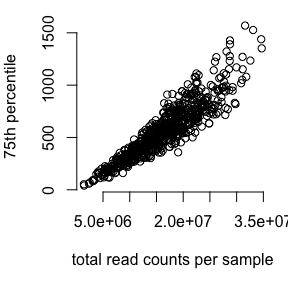<!-- -->

```r
table(rownames(imc) == names(edat))
```

```
## 
## TRUE 
##  670
```

```r
g1 = grep("ENSG00000141510", rownames(edat))
g1
```

```
## [1] 6611
```

```r
TP53 = unlist(edat[g1,])
summary(TP53)
```

```
##    Min. 1st Qu.  Median    Mean 3rd Qu.    Max. 
##    29.0   271.2   413.0   478.5   604.8  2161.0
```

```r
g1 = grep("ENSG00000102974", rownames(edat))
g1
```

```
## [1] 2307
```

```r
CTCF = unlist(edat[g1,])
summary(CTCF)
```

```
##    Min. 1st Qu.  Median    Mean 3rd Qu.    Max. 
##    45.0   464.2   682.0   771.9   986.5  3637.0
```

```r
TP53 = (TP53/rd0)*median(rd0)
CTCF = (CTCF/rd0)*median(rd0)

summary(TP53)
```

```
##    Min. 1st Qu.  Median    Mean 3rd Qu.    Max. 
##   74.95  304.98  424.48  475.90  591.36 1593.84
```

```r
summary(CTCF)
```

```
##    Min. 1st Qu.  Median    Mean 3rd Qu.    Max. 
##   229.6   556.0   698.8   747.2   900.6  2364.0
```

# Read in PEER factors and PCs


```r
cdat = read.table("data/Whole_Blood.v8.covariates.txt", header = T, 
                        sep ='\t', as.is = T, check.names = F)
dim(cdat)
```

```
## [1]  68 671
```

```r
cdat[1:3,1:2]
```

```
##    ID GTEX-111YS
## 1 PC1     0.0154
## 2 PC2    -0.0093
## 3 PC3     0.0107
```

```r
cdat$ID[1:10]
```

```
##  [1] "PC1"          "PC2"          "PC3"          "PC4"          "PC5"         
##  [6] "InferredCov1" "InferredCov2" "InferredCov3" "InferredCov4" "InferredCov5"
```

```r
rownames(cdat) = cdat$ID
cdat = data.matrix(cdat[c(1:2,6:10), -1])
dim(cdat)
```

```
## [1]   7 670
```

```r
cdat[1:3,1:2]
```

```
##               GTEX-111YS  GTEX-1122O
## PC1           0.01540000  0.01390000
## PC2          -0.00930000 -0.00970000
## InferredCov1 -0.03227512 -0.04936429
```

```r
cdat = data.frame(t(cdat))
dim(cdat)
```

```
## [1] 670   7
```

```r
cdat[1:3,1:2]
```

```
##               PC1     PC2
## GTEX-111YS 0.0154 -0.0093
## GTEX-1122O 0.0139 -0.0097
## GTEX-1128S 0.0145 -0.0093
```

```r
table(rownames(cdat) == names(edat))
```

```
## 
## TRUE 
##  670
```

# Read in covariate data

```r
xdat = read.table("data/GTEx_Analysis_v8_Annotations_SubjectPhenotypesDS.txt", 
                  as.is=TRUE, sep="\t", header=TRUE)
dim(xdat)
```

```
## [1] 980   4
```

```r
xdat[1:2,]
```

```
##       SUBJID SEX   AGE DTHHRDY
## 1 GTEX-1117F   2 60-69       4
## 2 GTEX-111CU   1 50-59       0
```

```r
xdat = xdat[match(names(edat), xdat$SUBJID),]
dim(xdat)
```

```
## [1] 670   4
```

```r
xdat[1:2,]
```

```
##       SUBJID SEX   AGE DTHHRDY
## 5 GTEX-111YS   1 60-69       0
## 6 GTEX-1122O   2 60-69       0
```

```r
table(rownames(imc) == xdat$SUBJID)
```

```
## 
## TRUE 
##  670
```

```r
age = strsplit(xdat$AGE, split="-")
age[1:2]
```

```
## [[1]]
## [1] "60" "69"
## 
## [[2]]
## [1] "60" "69"
```

```r
table(sapply(age, length))
```

```
## 
##   2 
## 670
```

```r
age = sapply(age, function(v){mean(as.numeric(v))})
table(age)
```

```
## age
## 24.5 34.5 44.5 54.5 64.5 74.5 
##   65   61  103  217  207   17
```

```r
xdat$age = round(age+0.01)
table(xdat$age)
```

```
## 
##  25  35  45  55  65  75 
##  65  61 103 217 207  17
```


# Read in the data used in dynamic eQTL analysis to double check

The very minor difference of gene expression is due to trimming of outlier values identified by large cook's distance.


```r
par(mar=c(5,4,1,1), bty="n")

dat_dyn = read.csv("data/Whole_Blood_glm_covariates0.csv")
dim(dat_dyn)
```

```
## [1] 670  17
```

```r
dat_dyn[1:2,]
```

```
##     X     SUBJID SEX   AGE DTHHRDY agen sex age     tp53     ctcf   gPC1
## 1  54 GTEX-11ZTT   2 60-69       0   65   1  65 2.626229 2.744323 0.0144
## 2 291 GTEX-15G1A   1 30-39       0   35  -1  35 2.292084 2.740519 0.0149
##      gPC2         PF1          PF2         PF3         PF4         PF5
## 1 -0.0046 -0.02723493 -0.008137036 0.006504894 0.003752476  0.01291703
## 2 -0.0062 -0.04841505 -0.006592670 0.006603068 0.057211164 -0.12913129
```

```r
table(dat_dyn$SUBJID == xdat$SUBJID)
```

```
## 
## FALSE  TRUE 
##   669     1
```

```r
setequal(dat_dyn$SUBJID,xdat$SUBJID)
```

```
## [1] TRUE
```

```r
mat1 = match(xdat$SUBJID, dat_dyn$SUBJID)
dat_dyn = dat_dyn[mat1,]
table(dat_dyn$SUBJID == xdat$SUBJID)
```

```
## 
## TRUE 
##  670
```

```r
cor(dat_dyn$tp53, log10(TP53))
```

```
## [1] 0.9976607
```

```r
plot(dat_dyn$tp53, log10(TP53), cex=0.5)
abline(0,1)
```

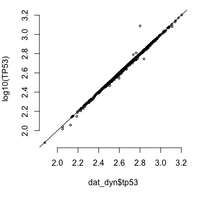<!-- -->

```r
cor(dat_dyn$ctcf, log10(CTCF))
```

```
## [1] 0.9944008
```

```r
plot(dat_dyn$ctcf, log10(CTCF), cex=0.5)
abline(0,1)
```

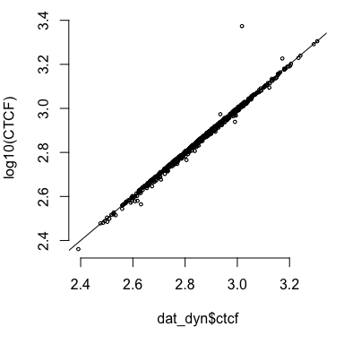<!-- -->

```r
table(xdat$age,dat_dyn$age)
```

```
##     
##       25  35  45  55  65  75
##   25  65   0   0   0   0   0
##   35   0  61   0   0   0   0
##   45   0   0 103   0   0   0
##   55   0   0   0 217   0   0
##   65   0   0   0   0 207   0
##   75   0   0   0   0   0  17
```

```r
TP53 = dat_dyn$tp53
CTCF = dat_dyn$ctcf
```

# check associations for age

```r
par(mar=c(5,4,1,1), bty="n")
boxplot(imc$Neutrophils ~ xdat$age, ylab="Neutrophils", xlab="Age")
```

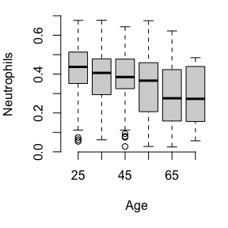<!-- -->

# check associations for CTCF

```r
par(mar=c(5,4,1,1), bty="n")

cr1 = cor(imc, CTCF, method="spearman")
df1 = data.frame(cell_type = rownames(cr1), cr_CTCF=round(cr1,3))
rownames(df1) = NULL
df1 = df1[order(df1$cr_CTCF),]
df1
```

```
##                       cell_type cr_CTCF
## 5             T cells CD4 naive  -0.577
## 22                  Neutrophils  -0.420
## 13                    Monocytes  -0.411
## 14               Macrophages M0  -0.375
## 19           Mast cells resting  -0.234
## 15               Macrophages M1  -0.181
## 1                 B cells naive  -0.110
## 12           NK cells activated  -0.048
## 18    Dendritic cells activated  -0.046
## 10          T cells gamma delta   0.065
## 16               Macrophages M2   0.067
## 8     T cells follicular helper   0.147
## 17      Dendritic cells resting   0.152
## 9    T cells regulatory (Tregs)   0.246
## 21                  Eosinophils   0.251
## 2                B cells memory   0.283
## 3                  Plasma cells   0.363
## 11             NK cells resting   0.404
## 6    T cells CD4 memory resting   0.437
## 7  T cells CD4 memory activated   0.452
## 20         Mast cells activated   0.472
## 4                   T cells CD8   0.482
```

```r
cr2 = cor(cdat, CTCF, method="spearman")
df2 = data.frame(variables = rownames(cr2), cr_CTCF=round(cr2,3))
rownames(df2) = NULL
df2
```

```
##      variables cr_CTCF
## 1          PC1   0.018
## 2          PC2  -0.011
## 3 InferredCov1   0.572
## 4 InferredCov2   0.479
## 5 InferredCov3   0.189
## 6 InferredCov4  -0.161
## 7 InferredCov5  -0.044
```

```r
plot(imc$`NK cells activated`, CTCF, xlab="NK cells activated", cex=0.5)
```

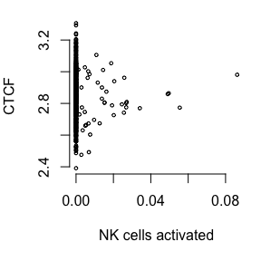<!-- -->

```r
plot(imc$`B cells memory`, CTCF, xlab="B cells memory", cex=0.5)
```

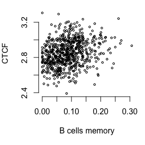<!-- -->

```r
plot(cdat$InferredCov4, log10(CTCF), xlab="PEER factor 4", cex=0.5)
```

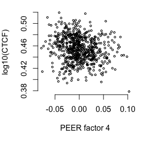<!-- -->

```r
plot(cdat$InferredCov5, log10(CTCF), xlab="PEER factor 5", cex=0.5)
```

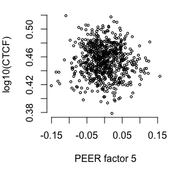<!-- -->

```r
fit0 = lm(CTCF ~ ., data = log_imc)
summary(fit0)
```

```
## 
## Call:
## lm(formula = CTCF ~ ., data = log_imc)
## 
## Residuals:
##      Min       1Q   Median       3Q      Max 
## -0.37506 -0.07506  0.00700  0.07321  0.33631 
## 
## Coefficients:
##                                Estimate Std. Error t value Pr(>|t|)    
## (Intercept)                   3.0273432  0.0537815  56.290  < 2e-16 ***
## B.cells.naive                 0.0011485  0.0010823   1.061  0.28901    
## B.cells.memory                0.0009891  0.0032335   0.306  0.75979    
## Plasma.cells                  0.0083152  0.0020868   3.985 7.53e-05 ***
## T.cells.CD8                   0.0016484  0.0013005   1.267  0.20543    
## T.cells.CD4.naive            -0.0064022  0.0015208  -4.210 2.92e-05 ***
## T.cells.CD4.memory.resting    0.0074120  0.0011308   6.554 1.14e-10 ***
## T.cells.CD4.memory.activated  0.0025886  0.0027308   0.948  0.34352    
## T.cells.follicular.helper     0.0040496  0.0025263   1.603  0.10942    
## T.cells.regulatory..Tregs.    0.0031748  0.0012728   2.494  0.01287 *  
## T.cells.gamma.delta          -0.0006144  0.0012437  -0.494  0.62143    
## NK.cells.resting             -0.0002563  0.0020788  -0.123  0.90193    
## NK.cells.activated           -0.0011353  0.0023873  -0.476  0.63454    
## Monocytes                    -0.0002310  0.0020747  -0.111  0.91139    
## Macrophages.M0               -0.0053177  0.0017243  -3.084  0.00213 ** 
## Macrophages.M1                0.0017782  0.0021889   0.812  0.41689    
## Macrophages.M2                0.0026693  0.0013081   2.041  0.04170 *  
## Dendritic.cells.resting       0.0016102  0.0025498   0.632  0.52793    
## Dendritic.cells.activated    -0.0027268  0.0011138  -2.448  0.01462 *  
## Mast.cells.resting            0.0021020  0.0019168   1.097  0.27320    
## Mast.cells.activated          0.0024433  0.0017786   1.374  0.16999    
## Eosinophils                  -0.0006272  0.0012123  -0.517  0.60511    
## ---
## Signif. codes:  0 '***' 0.001 '**' 0.01 '*' 0.05 '.' 0.1 ' ' 1
## 
## Residual standard error: 0.1149 on 648 degrees of freedom
## Multiple R-squared:  0.4277,	Adjusted R-squared:  0.4092 
## F-statistic: 23.06 on 21 and 648 DF,  p-value: < 2.2e-16
```

```r
df0 = data.frame(fitted=fitted(fit0), CTCF)
dim(df0)
```

```
## [1] 670   2
```

```r
df0[1:2,]
```

```
##              fitted     CTCF
## GTEX-111YS 2.706384 2.720805
## GTEX-1122O 2.922179 2.847795
```

```r
plot(df0$fitted, df0$CTCF, xlab = 'Fitted values',
     ylab = "CTCF", main = '', pch = 19, cex=0.5)
```

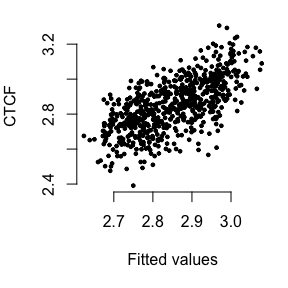<!-- -->

```r
fit1 = lm(CTCF ~ ., data = cdat)
summary(fit1)
```

```
## 
## Call:
## lm(formula = CTCF ~ ., data = cdat)
## 
## Residuals:
##       Min        1Q    Median        3Q       Max 
## -0.302115 -0.058323 -0.000741  0.058547  0.243123 
## 
## Coefficients:
##               Estimate Std. Error t value Pr(>|t|)    
## (Intercept)   2.849481   0.003365 846.709  < 2e-16 ***
## PC1           0.007239   0.103552   0.070   0.9443    
## PC2          -0.092203   0.104426  -0.883   0.3776    
## InferredCov1  2.572674   0.104007  24.736  < 2e-16 ***
## InferredCov2  2.948220   0.126338  23.336  < 2e-16 ***
## InferredCov3  1.173693   0.129817   9.041  < 2e-16 ***
## InferredCov4 -0.763539   0.111189  -6.867 1.51e-11 ***
## InferredCov5 -0.140782   0.075480  -1.865   0.0626 .  
## ---
## Signif. codes:  0 '***' 0.001 '**' 0.01 '*' 0.05 '.' 0.1 ' ' 1
## 
## Residual standard error: 0.0871 on 662 degrees of freedom
## Multiple R-squared:  0.6639,	Adjusted R-squared:  0.6603 
## F-statistic: 186.8 on 7 and 662 DF,  p-value: < 2.2e-16
```

```r
df1 = data.frame(fitted=fitted(fit1), CTCF)
dim(df1)
```

```
## [1] 670   2
```

```r
df1[1:2,]
```

```
##              fitted     CTCF
## GTEX-111YS 2.756439 2.720805
## GTEX-1122O 2.813426 2.847795
```

```r
plot(df1$fitted, df1$CTCF, xlab = 'Fitted values',
     ylab = "CTCF", main = '', pch = 19, cex=0.5)
```

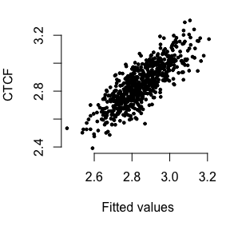<!-- -->

# check associations for TP53


```r
par(mar=c(5,4,1,1), bty="n")

cr1 = cor(imc, TP53, method="spearman")
df1 = data.frame(cell_type = rownames(cr1), cr1)
rownames(df1) = NULL
df1 = df1[order(df1$cr1),]
df1
```

```
##                       cell_type         cr1
## 22                  Neutrophils -0.51625070
## 14               Macrophages M0 -0.38681786
## 5             T cells CD4 naive -0.33459718
## 13                    Monocytes -0.28520736
## 15               Macrophages M1 -0.24521057
## 1                 B cells naive -0.11782325
## 18    Dendritic cells activated  0.08376681
## 11             NK cells resting  0.08734938
## 8     T cells follicular helper  0.09289872
## 17      Dendritic cells resting  0.11158444
## 10          T cells gamma delta  0.12479625
## 6    T cells CD4 memory resting  0.12568221
## 19           Mast cells resting  0.13037756
## 16               Macrophages M2  0.13500318
## 20         Mast cells activated  0.17766477
## 12           NK cells activated  0.22216507
## 21                  Eosinophils  0.32715338
## 7  T cells CD4 memory activated  0.40819802
## 3                  Plasma cells  0.42410478
## 9    T cells regulatory (Tregs)  0.45889059
## 2                B cells memory  0.48750158
## 4                   T cells CD8  0.56657811
```

```r
fit1 = lm(TP53 ~ ., data = log_imc)
summary(fit1)
```

```
## 
## Call:
## lm(formula = TP53 ~ ., data = log_imc)
## 
## Residuals:
##      Min       1Q   Median       3Q      Max 
## -0.53815 -0.09821  0.00102  0.10348  0.39789 
## 
## Coefficients:
##                                Estimate Std. Error t value Pr(>|t|)    
## (Intercept)                   2.9656053  0.0716859  41.369  < 2e-16 ***
## B.cells.naive                 0.0043504  0.0014426   3.016  0.00266 ** 
## B.cells.memory                0.0102167  0.0043099   2.370  0.01806 *  
## Plasma.cells                  0.0127811  0.0027815   4.595 5.20e-06 ***
## T.cells.CD8                   0.0083356  0.0017334   4.809 1.89e-06 ***
## T.cells.CD4.naive            -0.0058495  0.0020271  -2.886  0.00404 ** 
## T.cells.CD4.memory.resting    0.0030024  0.0015073   1.992  0.04680 *  
## T.cells.CD4.memory.activated  0.0167372  0.0036399   4.598 5.12e-06 ***
## T.cells.follicular.helper    -0.0006606  0.0033673  -0.196  0.84454    
## T.cells.regulatory..Tregs.    0.0072278  0.0016965   4.260 2.34e-05 ***
## T.cells.gamma.delta           0.0012537  0.0016577   0.756  0.44974    
## NK.cells.resting             -0.0066328  0.0027709  -2.394  0.01696 *  
## NK.cells.activated            0.0074216  0.0031821   2.332  0.01999 *  
## Monocytes                     0.0039332  0.0027654   1.422  0.15543    
## Macrophages.M0               -0.0051587  0.0022984  -2.244  0.02514 *  
## Macrophages.M1                0.0021625  0.0029177   0.741  0.45885    
## Macrophages.M2                0.0049267  0.0017436   2.826  0.00487 ** 
## Dendritic.cells.resting       0.0028295  0.0033986   0.833  0.40542    
## Dendritic.cells.activated    -0.0013867  0.0014846  -0.934  0.35060    
## Mast.cells.resting            0.0028753  0.0025549   1.125  0.26084    
## Mast.cells.activated         -0.0067988  0.0023707  -2.868  0.00427 ** 
## Eosinophils                  -0.0021081  0.0016160  -1.305  0.19251    
## ---
## Signif. codes:  0 '***' 0.001 '**' 0.01 '*' 0.05 '.' 0.1 ' ' 1
## 
## Residual standard error: 0.1531 on 648 degrees of freedom
## Multiple R-squared:  0.4712,	Adjusted R-squared:  0.4541 
## F-statistic:  27.5 on 21 and 648 DF,  p-value: < 2.2e-16
```

```r
df1 = data.frame(fitted=fitted(fit1), TP53)
dim(df1)
```

```
## [1] 670   2
```

```r
df1[1:2,]
```

```
##              fitted     TP53
## GTEX-111YS 2.321556 2.693986
## GTEX-1122O 2.501213 2.465899
```

```r
plot(df1$fitted, df1$TP53, xlab = 'Fitted values',
     ylab = "TP53", main = '', pch = 19, cex=0.5)
```

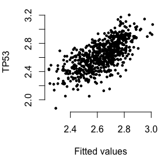<!-- -->

```r
plot(imc$`B cells memory`, TP53, xlab="B cells memory", cex=0.5)
```

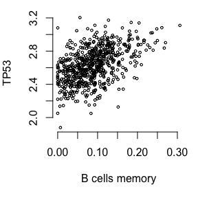<!-- -->

```r
plot(imc$Neutrophils, TP53, xlab="Neutrophils", cex=0.5)
```

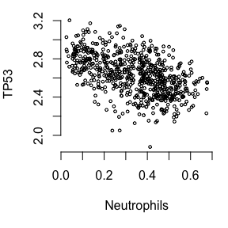<!-- -->

```r
cr2 = cor(cdat, TP53, method="spearman")
df2 = data.frame(variables = rownames(cr2), cr_TP53=round(cr2,3))
rownames(df2) = NULL
df2
```

```
##      variables cr_TP53
## 1          PC1  -0.073
## 2          PC2  -0.028
## 3 InferredCov1   0.590
## 4 InferredCov2   0.023
## 5 InferredCov3   0.670
## 6 InferredCov4  -0.025
## 7 InferredCov5   0.030
```

```r
plot(cdat$InferredCov2, log10(TP53), xlab="PEER factor 2", cex=0.5)
```

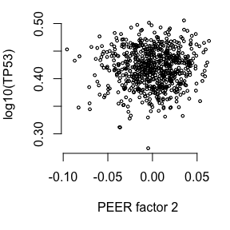<!-- -->

```r
plot(cdat$InferredCov3, log10(TP53), xlab="PEER factor 3", cex=0.5)
```

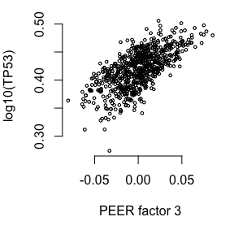<!-- -->

```r
fit1 = lm(TP53 ~ ., data = cdat)
summary(fit1)
```

```
## 
## Call:
## lm(formula = TP53 ~ ., data = cdat)
## 
## Residuals:
##       Min        1Q    Median        3Q       Max 
## -0.315152 -0.061857  0.004125  0.063438  0.286984 
## 
## Coefficients:
##               Estimate Std. Error t value Pr(>|t|)    
## (Intercept)   2.632128   0.003701 711.203  < 2e-16 ***
## PC1           0.073705   0.113878   0.647  0.51771    
## PC2           0.012342   0.114839   0.107  0.91444    
## InferredCov1  3.600033   0.114379  31.475  < 2e-16 ***
## InferredCov2  0.321521   0.138936   2.314  0.02096 *  
## InferredCov3  5.236328   0.142763  36.679  < 2e-16 ***
## InferredCov4 -0.492483   0.122277  -4.028 6.29e-05 ***
## InferredCov5  0.261801   0.083007   3.154  0.00168 ** 
## ---
## Signif. codes:  0 '***' 0.001 '**' 0.01 '*' 0.05 '.' 0.1 ' ' 1
## 
## Residual standard error: 0.09578 on 662 degrees of freedom
## Multiple R-squared:  0.7886,	Adjusted R-squared:  0.7863 
## F-statistic: 352.7 on 7 and 662 DF,  p-value: < 2.2e-16
```

```r
df1 = data.frame(fitted=fitted(fit1), TP53)
dim(df1)
```

```
## [1] 670   2
```

```r
df1[1:2,]
```

```
##              fitted     TP53
## GTEX-111YS 2.563656 2.693986
## GTEX-1122O 2.380195 2.465899
```

```r
plot(df1$fitted, df1$TP53, xlab = 'Fitted values',
     ylab = "TP53", main = '', pch = 19, cex=0.5)
```

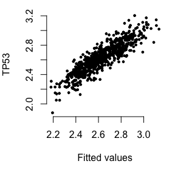<!-- -->


```r
gc()
```

```
##           used (Mb) gc trigger  (Mb) limit (Mb) max used  (Mb)
## Ncells  823305   44    1289638  68.9         NA  1289638  68.9
## Vcells 7856626   60   67908568 518.2      32768 84879562 647.6
```

```r
sessionInfo()
```

```
## R version 4.0.3 (2020-10-10)
## Platform: x86_64-apple-darwin17.0 (64-bit)
## Running under: macOS Big Sur 10.16
## 
## Matrix products: default
## BLAS:   /Library/Frameworks/R.framework/Versions/4.0/Resources/lib/libRblas.dylib
## LAPACK: /Library/Frameworks/R.framework/Versions/4.0/Resources/lib/libRlapack.dylib
## 
## locale:
## [1] en_US.UTF-8/en_US.UTF-8/en_US.UTF-8/C/en_US.UTF-8/en_US.UTF-8
## 
## attached base packages:
## [1] stats     graphics  grDevices utils     datasets  methods   base     
## 
## other attached packages:
## [1] ggplot2_3.3.3  reshape2_1.4.4
## 
## loaded via a namespace (and not attached):
##  [1] Rcpp_1.0.5       knitr_1.30       magrittr_2.0.1   tidyselect_1.1.0
##  [5] munsell_0.5.0    colorspace_2.0-0 R6_2.5.0         rlang_0.4.10    
##  [9] dplyr_1.0.2      stringr_1.4.0    plyr_1.8.6       tools_4.0.3     
## [13] grid_4.0.3       gtable_0.3.0     xfun_0.19        withr_2.3.0     
## [17] htmltools_0.5.0  ellipsis_0.3.1   yaml_2.2.1       digest_0.6.27   
## [21] tibble_3.0.4     lifecycle_0.2.0  crayon_1.3.4     purrr_0.3.4     
## [25] vctrs_0.3.6      glue_1.4.2       evaluate_0.14    rmarkdown_2.6   
## [29] stringi_1.5.3    compiler_4.0.3   pillar_1.4.7     generics_0.1.0  
## [33] scales_1.1.1     pkgconfig_2.0.3
```
